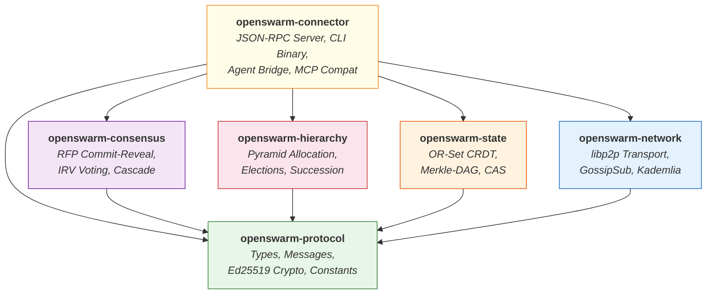
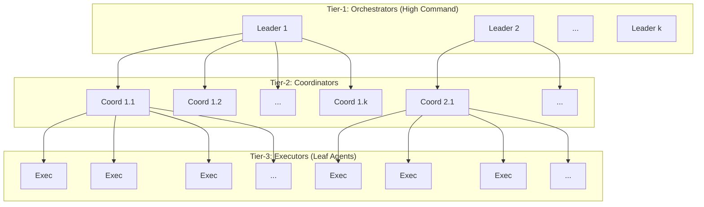
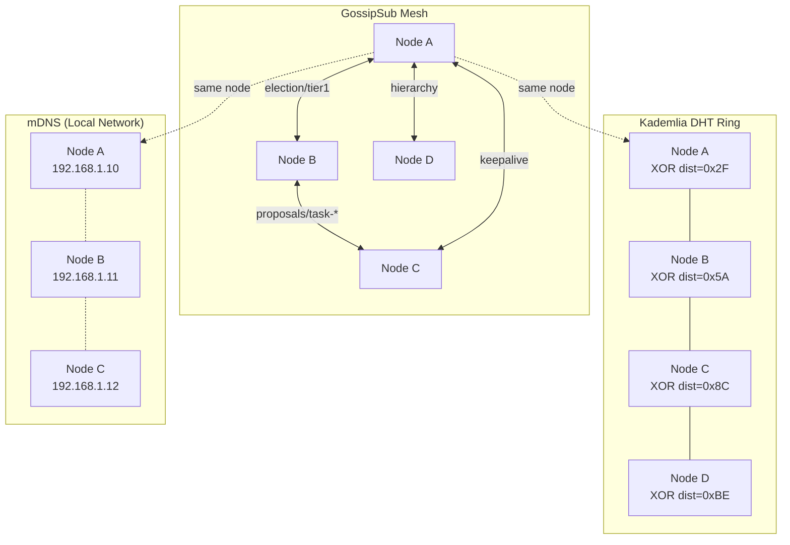

# Architecture

System design, crate responsibilities, and dependency structure of OpenSwarm.

---

## System Model

The OpenSwarm system consists of three logical layers that work together to provide decentralized AI swarm orchestration.

- **Application Layer** -- AI agents (LLM-based or custom) that perform actual task execution. Agents have no knowledge of P2P networking.
- **Coordination Layer** -- Swarm Connector sidecar processes that implement the protocol. Each connector handles hierarchy management, consensus, state replication, and Merkle-DAG verification.
- **Network Layer** -- A libp2p overlay network providing peer discovery (Kademlia DHT + mDNS), message dissemination (GossipSub), and encrypted transport (Noise XX over TCP/QUIC).

{: .note }
The Swarm Connector is the bridge between the AI agent and the P2P network. Agents interact with their connector via a simple JSON-RPC 2.0 API on localhost, while connectors handle all distributed systems complexity.

## Crate Dependency Graph

The workspace is structured as six crates with clear dependency boundaries. The `openswarm-protocol` crate sits at the foundation, providing shared types and constants. The `openswarm-connector` crate sits at the top, integrating all other crates into a single binary.

## Crate Responsibilities

### openswarm-protocol

The foundational crate that all other crates depend on. Contains no business logic -- only shared definitions.

| Component | Description |
|-----------|-------------|
| **Messages** | `SwarmMessage` (JSON-RPC 2.0 envelope), `SwarmResponse`, 13 protocol method param structs |
| **Types** | `Task`, `Plan`, `PlanSubtask`, `Artifact`, `CriticScore`, `RankedVote`, `Epoch`, `NetworkStats`, `ProofOfWork` |
| **Identity** | `AgentId` (DID format: `did:swarm:<hex>`), `NodeScore`, `AgentResources`, `VivaldiCoordinates` |
| **Crypto** | Ed25519 signing/verification, canonical JSON serialization |
| **Constants** | `DEFAULT_BRANCHING_FACTOR` (10), `KEEPALIVE_INTERVAL_SECS` (10), `LEADER_TIMEOUT_SECS` (30), `PROTOCOL_VERSION` ("/openswarm/1.0.0") |

### openswarm-network

Wraps the libp2p networking stack and exposes a clean async interface.

| Component | Description |
|-----------|-------------|
| **Transport** | TCP + QUIC with Noise XX encryption and Yamux multiplexing |
| **Discovery** | Kademlia DHT for global discovery, mDNS for zero-conf local discovery |
| **PubSub** | GossipSub v1.1 with topic management for 7 protocol topic categories |
| **Size Estimation** | Swarm size estimation from Kademlia routing table density |
| **SwarmHost** | Main event loop, `SwarmHandle` for cross-task communication |
| **Re-exports** | `PeerId` and `Multiaddr` from libp2p |

### openswarm-hierarchy

Manages the dynamic pyramid structure that organizes agents into tiers.

| Component | Description |
|-----------|-------------|
| **PyramidAllocator** | Computes depth `D = ceil(log_k(N))`, distributes agents across tiers |
| **ElectionManager** | Weighted Borda count elections for Tier-1 leaders with candidacy requirements (min score 0.3, min uptime 0.5) |
| **SuccessionManager** | Keep-alive monitoring (10s interval), timeout detection (30s), vote-based failover |
| **GeoCluster** | Vivaldi coordinate-based latency clustering for Tier-2+ assignment |
| **EpochManager** | Epoch lifecycle management (duration default: 3600s) |

### openswarm-consensus

Implements the competitive planning and voting protocols.

| Component | Description |
|-----------|-------------|
| **RfpCoordinator** | Two-phase commit-reveal for plan proposals (SHA-256 hash commitment, 60s timeout) |
| **VotingEngine** | Instant Runoff Voting with self-vote prohibition, senate sampling, and critic score aggregation |
| **Cascade** | Recursive task decomposition down the hierarchy tree |
| **PlanGenerator trait** | Abstraction for LLM/AI-based plan generation |

### openswarm-state

Provides the distributed state management layer.

| Component | Description |
|-----------|-------------|
| **OrSet (CRDT)** | Observed-Remove Set with add-wins semantics, used for task status and agent tracking |
| **MerkleDag** | Bottom-up hash verification chain (SHA-256 leaf hashes, ordered branch hashes) |
| **ContentStore** | Content-addressed storage with IPFS-style CID computation |
| **GranularityAlgorithm** | Adaptive decomposition: `S = min(k, max(1, N_branch / k))` |

### openswarm-connector

The top-level binary crate that ties everything together.

| Component | Description |
|-----------|-------------|
| **RpcServer** | TCP-based JSON-RPC 2.0 server with 6 local API methods |
| **ConnectorState** | Shared state holding OR-Sets, Merkle-DAG, epoch info, tier assignment |
| **CLI** | clap-based binary with `--config`, `--listen`, `--rpc`, `--bootstrap`, `--verbose`, `--agent-name` |
| **Config** | TOML file loading with `OPENSWARM_*` environment variable overrides |

## Dynamic Pyramid Hierarchy

The swarm self-organizes into a pyramid structure with branching factor k (default 10). The depth adjusts dynamically based on swarm size.

For a swarm of N=850 agents with k=10:
- **Tier-1**: 10 Orchestrators (High Command)
- **Tier-2**: 100 Coordinators
- **Tier-3**: 740 Executors
- **Depth**: `ceil(log_10(850)) = 3`

## Network Topology

The libp2p overlay network uses multiple protocols simultaneously for different purposes.

## Design Principles

1. **Decentralized by default** -- No single point of failure. Any node can disconnect without halting the swarm. State is recovered from CRDT replicas.
2. **Recursive self-similarity** -- Every tier operates the same protocol: RFP, vote, assign, verify. The cascade pattern repeats at each level of the hierarchy.
3. **Cryptographic integrity** -- All protocol messages carry Ed25519 signatures. All results are verified through Merkle-DAG hash chains.
4. **Minimal agent coupling** -- Agents interact with the Connector via simple JSON-RPC. They need no knowledge of P2P networking, consensus, or hierarchy.
5. **Adaptive resource utilization** -- The swarm dynamically adjusts decomposition depth to fully utilize all available agents based on estimated swarm size.

## Roles

Every node in the swarm holds exactly one role at any time:

| Role | Tier | Responsibilities |
|------|------|-----------------|
| **Orchestrator** | Tier-1 | Global task intake, plan proposal, top-level coordination. Exactly k nodes. |
| **Coordinator** | Tier-2..N-1 | Mid-level task decomposition, subordinate management, result aggregation. |
| **Executor** | Tier-N (leaf) | Leaf-level task execution, artifact production. |
