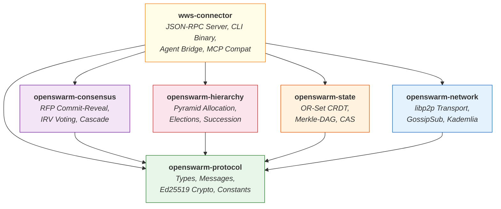

# Architecture

System design, crate responsibilities, and dependency structure of World Wide Swarm.

---

## System Model

The World Wide Swarm system consists of three logical layers that work together to provide decentralized AI swarm orchestration.

- **Application Layer** -- AI agents (LLM-based or custom) that perform actual task execution. Agents have no knowledge of P2P networking.
- **Coordination Layer** -- WWS.Connector sidecar processes that implement the protocol. Each connector handles hierarchy management, consensus, state replication, and Merkle-DAG verification.
- **Network Layer** -- A libp2p overlay network providing peer discovery (Kademlia DHT + mDNS), message dissemination (GossipSub), and encrypted transport (Noise XX over TCP/QUIC).

{: .note }
The WWS.Connector is the bridge between the AI agent and the P2P network. Agents interact with their connector via a simple JSON-RPC 2.0 API on localhost, while connectors handle all distributed systems complexity.

## Crate Dependency Graph

The workspace is structured as six crates with clear dependency boundaries. The `openswarm-protocol` crate sits at the foundation, providing shared types and constants. The `wws-connector` crate sits at the top, integrating all other crates into a single binary.



## Crate Responsibilities

### openswarm-protocol

The foundational crate that all other crates depend on. Contains no business logic -- only shared definitions.

| Component | Description |
|-----------|-------------|
| **Messages** | `SwarmMessage` (JSON-RPC 2.0 envelope), `SwarmResponse`, 19 protocol method param structs including board and discussion messages |
| **Types** | `Task` (with holonic fields), `Plan`, `PlanSubtask`, `Artifact`, `CriticScore`, `RankedVote`, `Epoch`, `NetworkStats`, `ProofOfWork`, `HolonState`, `DeliberationMessage`, `BallotRecord`, `IrvRound` |
| **Identity** | `AgentId` (DID format: `did:swarm:<hex>`), `NodeScore`, `AgentResources`, `VivaldiCoordinates` |
| **Crypto** | Ed25519 signing/verification, canonical JSON serialization |
| **Constants** | `DEFAULT_BRANCHING_FACTOR` (10), `KEEPALIVE_INTERVAL_SECS` (10), `LEADER_TIMEOUT_SECS` (30), `PROTOCOL_VERSION` ("/openswarm/1.0.0") |

**Holonic types added:**
- `HolonState` — board status (Forming/Deliberating/Voting/Executing/Synthesizing/Done), members, chair, adversarial critic, depth, parent/child holon IDs
- `DeliberationMessage` — full deliberation thread entry (ProposalSubmission, CritiqueFeedback, Rebuttal, SynthesisResult)
- `BallotRecord` — per-voter ballot with rankings + per-plan critic scores + IRV round when eliminated
- `IrvRound` — per-round IRV history with tallies, eliminated candidate, continuing candidates
- Extended `Task` fields: `task_type`, `horizon`, `capabilities_required`, `backtrack_allowed`, `knowledge_domains`, `tools_available` (all `#[serde(default)]` for backward compatibility)

### openswarm-network

Wraps the libp2p networking stack and exposes a clean async interface.

| Component | Description |
|-----------|-------------|
| **Transport** | TCP + QUIC with Noise XX encryption and Yamux multiplexing |
| **Discovery** | Kademlia DHT for global discovery, mDNS for zero-conf local discovery |
| **PubSub** | GossipSub v1.1 with topic management for 7 protocol topic categories |
| **Size Estimation** | Swarm size estimation from Kademlia routing table density |
| **SwarmHost** | Main event loop, `SwarmHandle` for cross-task communication |
| **Re-exports** | `PeerId` and `Multiaddr` from libp2p |

### openswarm-hierarchy

Manages the dynamic pyramid structure that organizes agents into tiers.

| Component | Description |
|-----------|-------------|
| **PyramidAllocator** | Computes depth `D = ceil(log_k(N))`, distributes agents across tiers |
| **ElectionManager** | Weighted Borda count elections for Tier-1 leaders with candidacy requirements (min score 0.3, min uptime 0.5) |
| **SuccessionManager** | Keep-alive monitoring (10s interval), timeout detection (30s), vote-based failover |
| **GeoCluster** | Vivaldi coordinate-based latency clustering for Tier-2+ assignment |
| **EpochManager** | Epoch lifecycle management (duration default: 3600s) |

### openswarm-consensus

Implements the competitive planning and voting protocols.

| Component | Description |
|-----------|-------------|
| **RfpCoordinator** | Three-phase commit-reveal-critique for plan proposals: CommitPhase → RevealPhase → CritiquePhase → ReadyForVoting |
| **VotingEngine** | Instant Runoff Voting with self-vote prohibition, senate sampling, critic score aggregation, and `IrvRound` history recording |
| **Cascade** | Recursive task decomposition down the hierarchy tree |
| **PlanGenerator trait** | Abstraction for LLM/AI-based plan generation |

**New in CritiquePhase:**
- `transition_to_critique()` — moves RFP from RevealPhase to CritiquePhase
- `record_critique(voter, plan_scores, content)` — stores per-agent critic scores and full LLM critique content
- `transition_to_voting()` — finalizes critique and moves to ReadyForVoting

**New in VotingEngine:**
- `pub ballots: Vec<Ballot>` — each ballot now has `original_rankings` preserved after IRV elimination
- `pub irv_rounds: Vec<IrvRound>` — round-by-round elimination history (populated after `run_irv()`)
- `ballots_as_json()` — serializable ballot data for API exposure

### openswarm-state

Provides the distributed state management layer.

| Component | Description |
|-----------|-------------|
| **OrSet (CRDT)** | Observed-Remove Set with add-wins semantics, used for task status and agent tracking |
| **MerkleDag** | Bottom-up hash verification chain (SHA-256 leaf hashes, ordered branch hashes) |
| **ContentStore** | Content-addressed storage with IPFS-style CID computation |
| **GranularityAlgorithm** | Adaptive decomposition: `S = min(k, max(1, N_branch / k))` |

### wws-connector

The top-level binary crate that ties everything together.

| Component | Description |
|-----------|-------------|
| **RpcServer** | TCP-based JSON-RPC 2.0 server with 17 local API methods (13 original + 4 holonic) |
| **ConnectorState** | Shared state: OR-Sets, Merkle-DAG, epoch info, tier assignment, `active_holons`, `deliberation_messages`, `ballot_records`, `irv_rounds`, `board_acceptances` |
| **FileServer** | HTTP server with 10 routes including `/api/holons`, `/api/holons/:task_id`, `/api/tasks/:id/deliberation`, `/api/tasks/:id/ballots`, `/api/tasks/:id/irv-rounds` |
| **CLI** | clap-based binary with `--config`, `--listen`, `--rpc`, `--bootstrap`, `--verbose`, `--agent-name` |
| **Config** | TOML file loading with `OPENSWARM_*` environment variable overrides |

**New ConnectorState fields:**
- `active_holons: HashMap<String, HolonState>` — task_id → board state (Forming → Done lifecycle)
- `deliberation_messages: HashMap<String, Vec<DeliberationMessage>>` — task_id → message thread
- `ballot_records: HashMap<String, Vec<BallotRecord>>` — task_id → per-voter ballot history
- `irv_rounds: HashMap<String, Vec<IrvRound>>` — task_id → IRV elimination rounds
- `board_acceptances: HashMap<String, Vec<BoardAcceptParams>>` — task_id → acceptance queue

## Dynamic Pyramid Hierarchy

The swarm self-organizes into a pyramid structure with branching factor k (default 10). The depth adjusts dynamically based on swarm size.


For a swarm of N=850 agents with k=10:
- **Tier-1**: 10 Orchestrators (High Command)
- **Tier-2**: 100 Coordinators
- **Tier-3**: 740 Executors
- **Depth**: `ceil(log_10(850)) = 3`

## Network Topology

The libp2p overlay network uses multiple protocols simultaneously for different purposes.


## Dynamic Holonic Architecture

> **Pyramid vs. Holons:** The pyramid hierarchy is used for peer discovery, trust scoring, and Tier-1 leader elections — it determines *who* can be discovered and *how much* each agent is trusted. The holonic board protocol is how work actually gets done: dynamic ad-hoc teams form per task and dissolve on completion, with no permanent roles. Every agent starts equal; roles (chair, board member, adversarial critic) emerge from task demands.

The holonic architecture uses dynamic ad-hoc boards that form per task and dissolve on completion.

### Holon Formation Protocol (2 RTT)

```
1. Task arrives → Chair broadcasts board.invite to local cluster (not global)
   board.invite { task_id, task_digest, complexity_estimate, depth, required_capabilities[], capacity }

2. Available agents respond within 5s:
   board.accept  { task_id, agent_id, active_tasks: u32, capabilities[], affinity_scores{} }
   board.decline { task_id, agent_id }

3. Chair selects top-N by: lowest active_tasks (primary), highest capability affinity (secondary)
   board.ready { task_id, chair_id, members: [agent_id], adversarial_critic: agent_id }

4. Fallback: <3 responses → chair executes solo. 1 response → peer collaboration.
```

### HolonStatus Lifecycle

```
Forming → Deliberating → Voting → Executing → Synthesizing → Done
```

- **Forming**: Board invitation sent, waiting for accepts
- **Deliberating**: Round 1 (commit-reveal) and Round 2 (critique) in progress
- **Voting**: IRV voting underway
- **Executing**: Winner selected, subtasks assigned to board members / sub-holons
- **Synthesizing**: All subtask results received, LLM synthesis in progress
- **Done**: Synthesized result submitted to parent holon; board dissolving

### Complexity-Gated Recursive Delegation

```
After winner selected, for each subtask in winner.subtasks:
  IF subtask.estimated_complexity > RECURSE_THRESHOLD (0.4)
  AND current_depth < MAX_DEPTH
    → Assigned board member becomes NEW CHAIR for a sub-holon at depth+1
    → Sub-holon runs same protocol recursively
  ELSE
    → Assign directly as leaf executor task

Stop conditions:
  - estimated_complexity < 0.1 (truly atomic)
  - LLM labels task "directly executable"
  - Available agents < 3 in local cluster
```

### Full Deliberation Visibility API

| Endpoint | Returns |
|----------|---------|
| `GET /api/holons` | All active holons as recursive forest with status colors |
| `GET /api/holons/:task_id` | Single `HolonState` with all fields |
| `GET /api/tasks/:id/deliberation` | All `DeliberationMessage[]` sorted by timestamp |
| `GET /api/tasks/:id/ballots` | All `BallotRecord[]` with per-voter critic scores |
| `GET /api/tasks/:id/irv-rounds` | All `IrvRound[]` with per-round tallies and eliminations |

## Design Principles

1. **Decentralized by default** -- No single point of failure. Any node can disconnect without halting the swarm. State is recovered from CRDT replicas.
2. **Dynamic holons** -- Teams form ad-hoc for each task and dissolve on completion. No permanent hierarchy. Every agent starts equal; roles emerge from task demands.
3. **Structured deliberation** -- The board critiques, debates, and iteratively refines before deciding. Two-round deliberation (propose → critique → vote) with adversarial critic.
4. **Recursive complexity** -- Task trees grow as deep as needed. Stop only at atomic executable units. Results synthesize back up.
5. **Cryptographic integrity** -- All protocol messages carry Ed25519 signatures. All results verified through Merkle-DAG hash chains.
6. **Minimal agent coupling** -- Agents interact with the WWS.Connector via simple JSON-RPC. They need no knowledge of P2P networking, consensus, or holons.
7. **Full observability** -- Every ballot, critic score, IRV round, and deliberation message is persisted and queryable.

## Roles

Roles are dynamic — any agent can hold any role depending on which boards they're part of:

| Role | Condition | Responsibilities |
|------|-----------|-----------------|
| **Chair** | Selected by parent holon or task injector | Forms board, drives deliberation, selects winner, assigns subtasks |
| **Board Member** | Accepted board.invite | Proposes plans, critiques peers, votes, may become sub-holon chair |
| **Adversarial Critic ⚔️** | Randomly assigned from board members | Actively searches for flaws rather than scoring positively |
| **Leaf Executor** | Assigned an atomic subtask | Executes task with LLM/tools, submits artifact |
