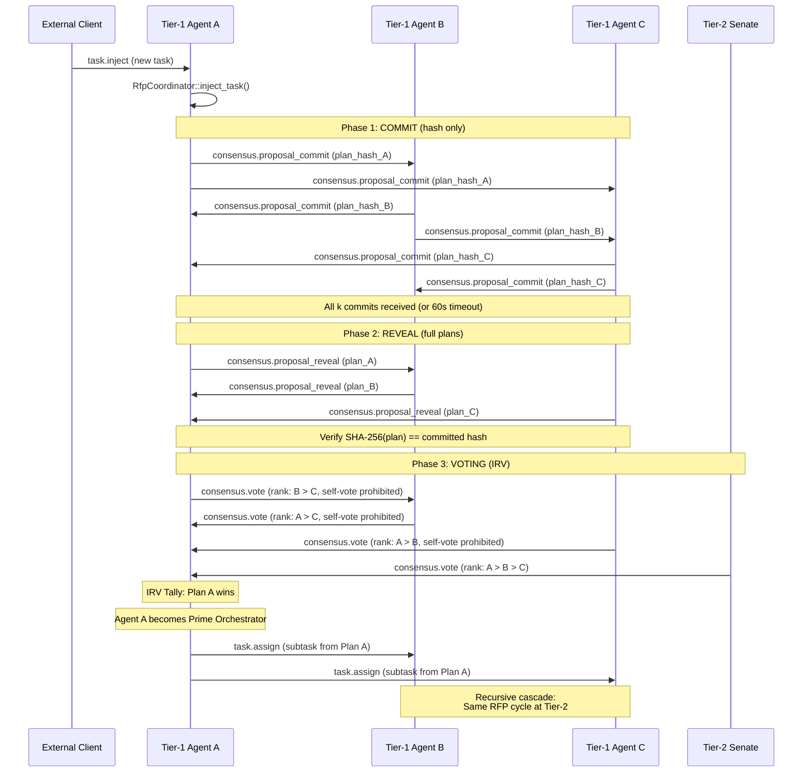
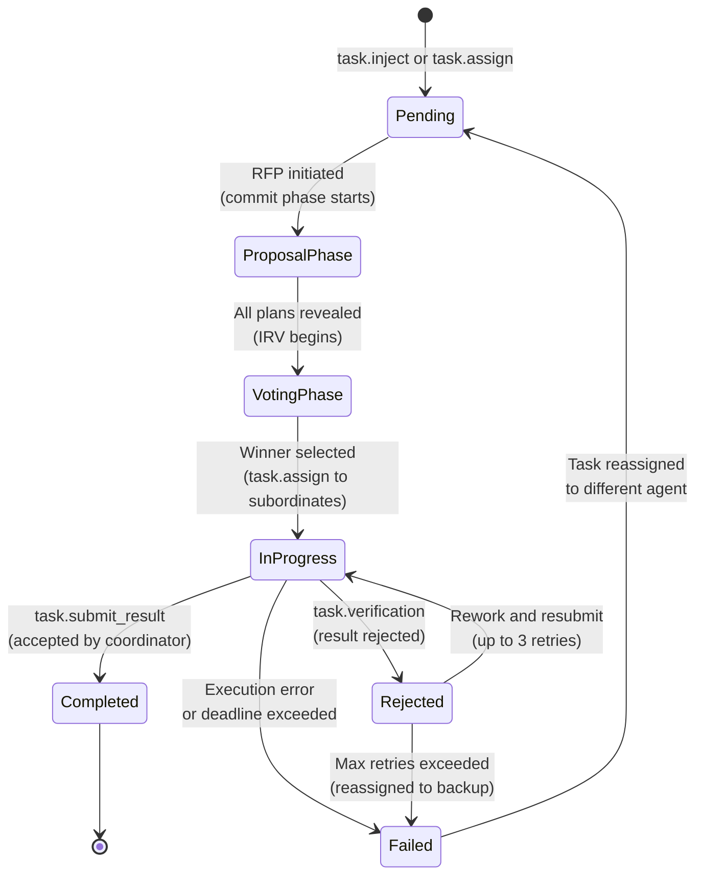

# Competitive Planning and Consensus

RFP commit-reveal, IRV voting, critic scores, and recursive cascade.

---

## Overview

When a task enters the swarm, it undergoes a three-phase competitive process managed by two key components:

1. **RfpCoordinator** -- Manages the Request for Proposal lifecycle with commit-reveal anti-plagiarism
2. **VotingEngine** -- Executes Instant Runoff Voting (IRV) with senate sampling and self-vote prohibition

After the winning plan is selected, the cascade mechanism recursively decomposes subtasks down the hierarchy using the same process at each tier.

## Full Consensus Flow



## RFP Protocol (Commit-Reveal-Critique)

The `RfpCoordinator` manages the Request for Proposal process, ensuring fair plan selection through a three-phase commit-reveal-critique scheme.

### RFP State Machine

The coordinator transitions through six phases:

1. **Idle** -- Waiting for task injection
2. **CommitPhase** -- Collecting SHA-256 plan hashes from board members
3. **RevealPhase** -- Collecting and verifying full plans
4. **CritiquePhase** (new) -- Board members score all plans using LLM; adversarial critic finds flaws
5. **ReadyForVoting** -- All plans revealed and critiqued; ready for IRV with populated critic scores
6. **Completed** -- Plan selected, RFP finished

### Phase 1: Commit

Each Tier-1 agent independently generates a task decomposition plan (using their AI/LLM backend via the `PlanGenerator` trait), then:

1. Computes `plan_hash = SHA-256(canonical_json(plan))`
2. Publishes only the hash via `consensus.proposal_commit`
3. The `RfpCoordinator` stores the `(proposer, plan_hash)` pair

**Wait condition:** All k Tier-1 agents submit commits, OR a timeout of **60 seconds** (`COMMIT_REVEAL_TIMEOUT_SECS`) elapses.

When all expected commits are received, the coordinator auto-transitions to the reveal phase. If the timeout is reached, `transition_to_reveal()` can be called manually.

### Phase 2: Reveal

Each agent reveals their full plan via `consensus.proposal_reveal`. The coordinator:

1. Looks up the previously committed hash for the proposer
2. Computes `SHA-256(canonical_json(revealed_plan))`
3. Verifies the computed hash matches the committed hash
4. If mismatch, the reveal is rejected with `ConsensusError::HashMismatch`

{: .note }
The commit-reveal scheme prevents plagiarism. Because agents commit to their plan hash before seeing any other plans, they cannot copy another agent's approach. Any attempt to submit a different plan in the reveal phase will fail hash verification.

### Commit-Reveal Verification

```
Commit Phase:   Agent publishes H = SHA-256(plan_json)
                     |
                     v
Reveal Phase:   Agent publishes full plan_json
                     |
                     v
Verification:   SHA-256(plan_json) == H ?
                  Yes -> Accept plan for voting
                  No  -> Reject (HashMismatch error)
```

### Phase 3: Critique (CritiquePhase)

After all plans are revealed, `transition_to_critique()` moves the RFP to `CritiquePhase`. Each board member runs an LLM critique:

**Standard member prompt:**
> "You see N decomposition plans. Score each: feasibility/parallelism/completeness/risk (0.0–1.0). Output JSON."

**Adversarial critic prompt:**
> "You are the adversarial critic. Your role is to find all flaws, risks, and weaknesses in each plan. Score each: feasibility/parallelism/completeness/risk. Be skeptical."

Each member submits a `discussion.critique` message with:
- `plan_scores: HashMap<plan_id, CriticScore>` — numerical scores per plan
- `content: String` — full LLM critique text (not truncated)

Stored as `DeliberationMessage { message_type: CritiqueFeedback, round: 2 }` for full audit trail.

After all critiques received (or timeout), `transition_to_voting()` moves back to `ReadyForVoting` with `critique_scores` populated. IRV then uses these scores for tiebreaking.

```rust
// RfpCoordinator API
rfp.transition_to_critique().unwrap();           // CommitPhase/RevealPhase → CritiquePhase
rfp.record_critique(voter, plan_scores, text);   // Store one agent's critique
rfp.transition_to_voting().unwrap();             // CritiquePhase → ReadyForVoting
```

## IRV Voting

The `VotingEngine` implements Instant Runoff Voting for selecting the winning plan.

### Electorate

- All k **Tier-1 agents** rank all plans EXCEPT their own (self-vote prohibition)
- A random sample of **Tier-2 agents ("Senate")** -- size: `min(k, tier2_count / 2)`

### Self-Vote Prohibition

An agent CANNOT rank their own proposal as their first choice. The `VotingEngine` checks the `plan_proposers` map and rejects any vote where the voter's own plan is ranked first, returning `ConsensusError::SelfVoteProhibited`.

This prevents gaming the system: if self-voting were allowed, every Tier-1 agent would naturally rank their own plan first, negating the voting mechanism.

### Senate Sampling

For large swarms, having all agents vote would create excessive overhead. The senate mechanism:

1. Collects the list of eligible Tier-2 voters
2. If the list exceeds `senate_size` (default: 100), randomly samples a subset
3. Only agents in the senate can submit valid votes
4. The seed can be fixed (`senate_seed`) for reproducible elections

### IRV Algorithm

```
1. Count first-choice votes for each plan
2. IF any plan has > 50% of first-choice votes -> WINNER
3. ELSE eliminate the plan with fewest first-choice votes
4. Redistribute eliminated plan's ballots to each voter's next preference
5. GOTO 1 (repeat until majority or one plan remains)
```

The algorithm terminates when:
- A plan achieves majority (> 50% of remaining valid ballots)
- Only one plan remains after all others are eliminated

### Critic Scores

Each voter provides detailed critic scores for plans they evaluate:

```json
{
  "feasibility": 0.9,
  "parallelism": 0.8,
  "completeness": 0.85,
  "risk": 0.2
}
```

The aggregate score formula:

```
aggregate = 0.30 * feasibility
          + 0.25 * parallelism
          + 0.30 * completeness
          + 0.15 * (1.0 - risk)
```

Critic scores are used for:
- **Tie-breaking**: If two plans tie in IRV vote count, the plan with the higher aggregate critic score wins
- **Quality tracking**: The winning plan's aggregate critic score is reported in the `VotingResult`
- **Deliberation visibility**: All critic scores per voter per plan are persisted in `BallotRecord[]` and exposed via `/api/tasks/:id/ballots`

Scores are aggregated across all voters who scored a plan by computing the mean of each dimension.

### IRV Round History

Every round of IRV is recorded as an `IrvRound` entry and stored in `ConnectorState.irv_rounds`:

```json
{
  "task_id": "task-abc-123",
  "round_number": 1,
  "tallies": { "plan-A": 2, "plan-B": 2, "plan-C": 1 },
  "eliminated": "plan-C",
  "continuing_candidates": ["plan-A", "plan-B"]
}
```

The final round (winner determination) also produces an `IrvRound` entry with `eliminated: null`.

Full history is queryable via `GET /api/tasks/:id/irv-rounds`.

### Ballot Visibility

Individual ballots are persisted in `BallotRecord` with:
- `rankings: Vec<PlanId>` — full original ranking order
- `critic_scores: HashMap<PlanId, CriticScore>` — per-plan scores from this voter
- `irv_round_when_eliminated: Option<u32>` — if voter's top choice was eliminated, which round

Queryable via `GET /api/tasks/:id/ballots`.

## Recursive Decomposition Cascade

After the winning plan is selected, its subtasks cascade down the hierarchy. The proposer of the winning plan becomes the **Prime Orchestrator** for that task.

### Cascade Process

1. The winning plan's k subtasks are assigned to k Tier-1 agents via `task.assign`
2. Each Tier-1 agent now has a subtask and initiates a NEW RFP cycle with its k Tier-2 subordinates
3. The same commit-reveal-vote process repeats at each tier level
4. This continues recursively until a **stop condition** is met

### Stop Conditions

| Condition | Description |
|-----------|-------------|
| **Atomic task** | The task cannot be meaningfully decomposed further |
| **Bottom of hierarchy** | Current tier is the Executor level (leaf tier) |
| **Low complexity** | Subtask complexity is below the configurable threshold |

### Assignment Strategy

Subtasks from the winning plan are assigned using round-robin among the subordinate agents at the next tier level. Each subordinate receives one subtask from the winning plan.

## Task State Machine

Every task transitions through a well-defined state machine as it moves through the consensus and execution pipeline.



### Task Status Values

| Status | Description |
|--------|-------------|
| `Pending` | Task created but not yet in RFP phase |
| `ProposalPhase` | Commit-reveal in progress; collecting plans |
| `VotingPhase` | IRV voting in progress |
| `InProgress` | Task assigned and being executed |
| `Completed` | Task finished successfully with verified result |
| `Failed` | Task execution failed; may be reassigned |
| `Rejected` | Result rejected during verification; may be reworked |

## Error Recovery

| Failure | Recovery Strategy |
|---------|-------------------|
| Agent disconnects mid-task | Task reassigned to backup agent. Coordinator retains state via CRDT. |
| Voting fails (timeout) | Extend timeout by 2x. If fails again, highest critic-score plan wins by default. |
| Result validation fails | Task returned to executor with rejection reason. Max 3 retries before reassignment. |
| Hash mismatch on reveal | Plan rejected. If too few plans remain, extend commit timeout and solicit new proposals. |
| No proposals submitted | `ConsensusError::NoProposals` -- task is escalated or retried with extended timeout. |
