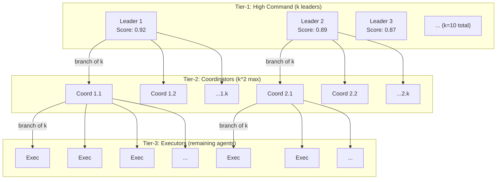
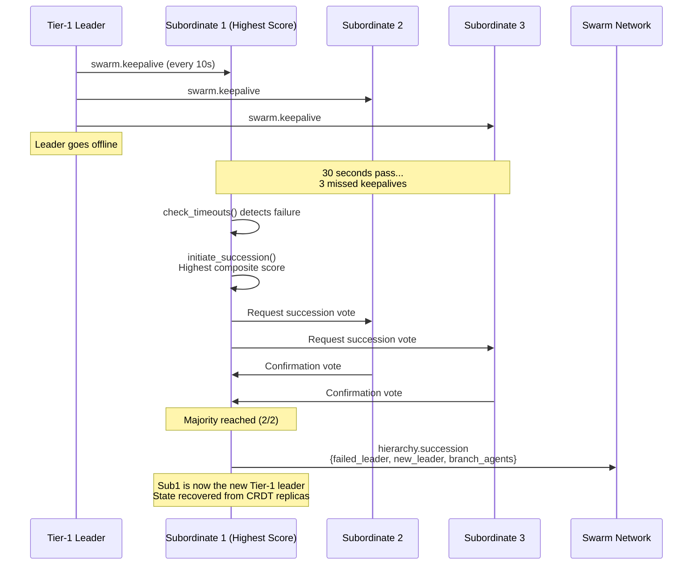
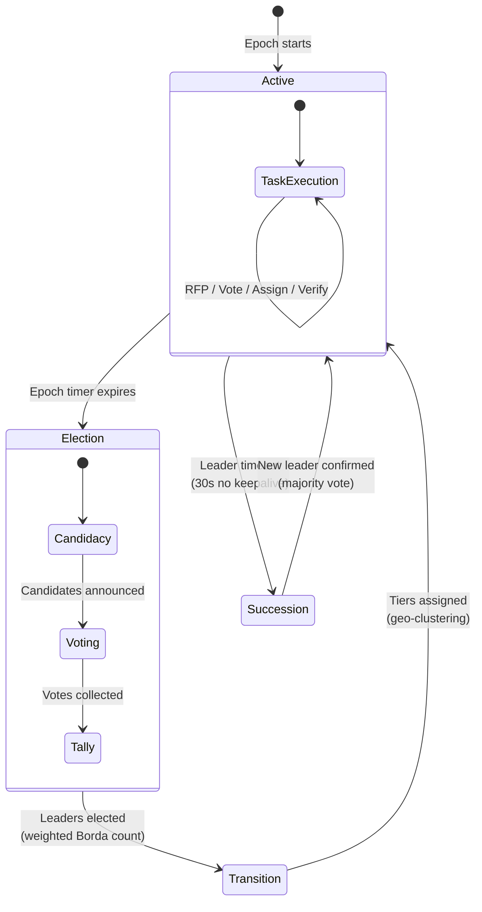

# Dynamic Hierarchy

Pyramid allocation, elections, epochs, and leader succession.

---

## Overview

The swarm organizes into a **Dynamic Pyramid** with branching factor `k` (default: 10). The hierarchy depth is computed dynamically based on the estimated swarm size `N`. This structure ensures:

- Every agent has a clear parent-child relationship
- Tasks flow top-down; results flow bottom-up
- The hierarchy adapts as agents join or leave
- Leadership is democratically elected and can be replaced via succession

{: .note }
The `PyramidAllocator` is an instance-based component created via `PyramidAllocator::new(PyramidConfig)` or `PyramidAllocator::default()`. It uses the `compute_depth()` and `compute_layout()` instance methods to determine hierarchy structure.

## Hierarchy Depth Formula

The pyramid depth is calculated as:

```
D = ceil(log_k(N))
```

Where:
- `N` = estimated swarm size (from Kademlia routing table density)
- `k` = branching factor (default: 10)
- `D` is clamped to `[1, MAX_HIERARCHY_DEPTH]` (max: 10)

### Depth Table (k=10)

| Swarm Size (N) | Depth (D) | Tier Structure |
|----------------|-----------|----------------|
| 1 | 1 | All are executors |
| 10 | 1 | Tier-1 only (all are orchestrators) |
| 11 | 2 | Tier-1 (10) + Executors (1) |
| 100 | 2 | Tier-1 (10) + Executors (90) |
| 101 | 3 | Tier-1 (10) + Tier-2 (100) + Executors (remainder) |
| 1,000 | 3 | Three tiers |
| 1,001 | 4 | Four tiers |
| 10,000 | 4 | Four tiers |
| 10,001 | 5 | Five tiers |

### Tier Distribution

The `PyramidAllocator::distribute(n, k)` function distributes N agents across tiers:

1. **Tier-1** gets `min(k, N)` leaders
2. **Intermediate tiers** each get `k * tier_above`, capped by remaining agents
3. **Bottom tier** (Executors) gets all remaining agents

For N=850, k=10:
- Tier-1: 10 Orchestrators
- Tier-2: 100 Coordinators
- Tier-3: 740 Executors

## Pyramid Hierarchy Diagram



## Tier Assignment

The `PyramidAllocator::assign_tier()` method maps an agent's rank (by composite score, highest first) to a tier:

- Agents ranked 0 through `tier1_count - 1` become **Tier-1** (unless single-tier, in which case they are Executors)
- The last tier index always maps to **Executor**
- Intermediate indices map to **Tier-2**, **TierN(3)**, etc.

{: .note }
Important implementation detail: the match for Executor (`n if n == last_tier_idx`) must be checked before Tier-2 (`1 => Tier::Tier2`) to avoid incorrect assignments in 2-tier hierarchies where the second tier should be Executor, not Tier-2 coordinators.

## Tier-1 Elections

Elections occur at the start of each epoch using a **weighted Borda count** algorithm managed by the `ElectionManager`.

### Election Lifecycle

1. **Candidacy Phase** -- Agents with sufficient scores broadcast `election.candidacy` messages
2. **Voting Phase** -- All agents submit ranked preferences via `election.vote`
3. **Tally Phase** -- Votes are counted using weighted Borda count and top-k candidates are elected

### Candidacy Requirements

| Requirement | Threshold | Constant |
|-------------|-----------|----------|
| Minimum composite score | 0.3 | `ElectionConfig::min_candidacy_score` |
| Minimum uptime fraction | 0.5 | `ElectionConfig::min_uptime` |
| Maximum candidates | 100 | `ElectionConfig::max_candidates` |

### Composite Score Formula

```
S = 0.25 * PoC + 0.40 * Reputation + 0.20 * Uptime + 0.15 * Stake
```

| Component | Range | Weight | Description |
|-----------|-------|--------|-------------|
| Proof of Compute (PoC) | 0.0-1.0 | 25% | Computational benchmark score at connection time |
| Reputation | 0.0-1.0 | 40% | Historical task success rate |
| Uptime | 0.0-1.0 | 20% | Fraction of current epoch the node has been online |
| Stake | 0.0-1.0 | 15% | Optional anti-Sybil stake (normalized) |

### Weighted Borda Count

The voting algorithm:

1. Each voter ranks candidates from most to least preferred
2. A candidate ranked #1 gets `(C-1)` points, #2 gets `(C-2)` points, etc., where C is the number of candidates ranked
3. Each voter's points are weighted by their own composite score (if they are a candidate) or weight 1.0 otherwise
4. Candidates are sorted by total weighted score (descending)
5. Ties are broken by composite score
6. The top `tier1_slots` candidates become Tier-1 leaders

### Geo-Clustering (Tier-2+ Assignment)

After Tier-1 leaders are elected, remaining agents join tiers based on network proximity:

1. Each Tier-1 leader announces k vacancies for Tier-2
2. Each remaining agent measures latency (Vivaldi coordinates) to all k Tier-1 leaders
3. The agent joins the leader with the **lowest latency**
4. Within each branch, the top-scoring agents become Tier-2 coordinators; the rest are assigned to lower tiers
5. The process repeats recursively until all agents have assignments

## Succession Protocol

The `SuccessionManager` handles leader failover when a Tier-1 leader becomes unresponsive.

### Monitoring

- Leaders send `swarm.keepalive` every **10 seconds** (`KEEPALIVE_INTERVAL_SECS`)
- Subordinates track the `last_seen` timestamp for their leader
- If a leader's keep-alive is not received for **30 seconds** (`LEADER_TIMEOUT_SECS` = 3 missed intervals), succession is triggered

### Succession Flow

1. **Timeout Detection** -- `SuccessionManager::check_timeouts()` detects the failed leader
2. **Succession Initiation** -- `initiate_succession()` collects branch agent scores and selects the highest-scored subordinate as the proposed new leader
3. **Confirmation Voting** -- Branch agents vote to confirm the proposed leader. A simple majority (branch_size / 2 + 1) is required
4. **Takeover** -- The new leader inherits the branch, broadcasts `hierarchy.succession`, and restores state from CRDT replicas
5. **Recovery** -- If the original leader recovers (sends a keep-alive), the succession is cancelled



## Epoch Lifecycle

An epoch is a discrete time period (default: 3600 seconds / 1 hour) during which hierarchy and roles are stable. At epoch boundaries, re-elections occur.



### Epoch Parameters

| Parameter | Default | Description |
|-----------|---------|-------------|
| `epoch_duration_secs` | 3600 | Duration of each epoch in seconds |
| `keepalive_interval_secs` | 10 | Interval between keep-alive pings |
| `leader_timeout_secs` | 30 | Timeout before triggering succession |
| `branching_factor` | 10 | Number of subordinates per coordinator (k) |
| `max_hierarchy_depth` | 10 | Maximum allowed pyramid depth |
