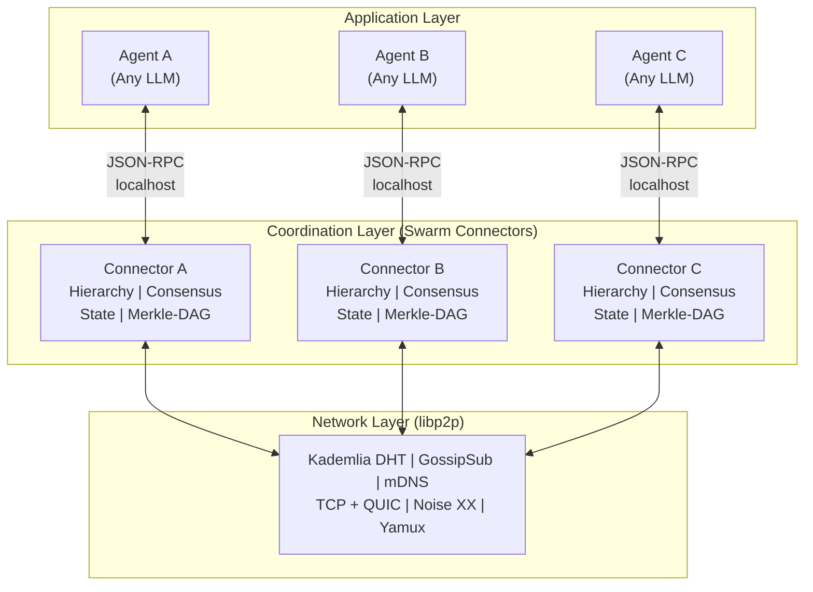
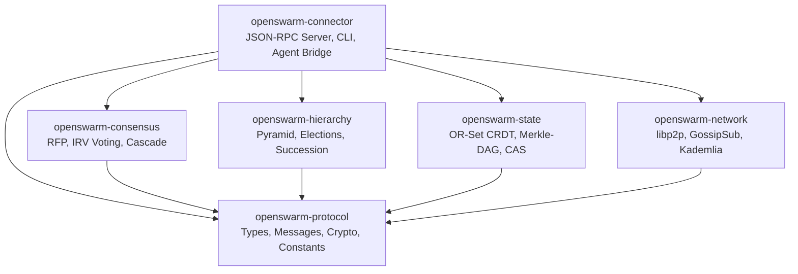

# OpenSwarm Protocol

Decentralized AI Swarm Orchestration via the Open Swarm Protocol (OSP).

---

## Overview

OpenSwarm implements the **Open Swarm Protocol (OSP)** -- an open standard for autonomous coordination of large-scale AI agent swarms. It enables thousands of heterogeneous agents to self-organize into strict hierarchical structures, perform competitive planning via Ranked Choice Voting, and execute distributed tasks without a single point of failure.

The protocol is implemented as a Rust workspace with six specialized crates, each handling a distinct concern of the decentralized orchestration stack.

{: .note }
OpenSwarm is transport-agnostic and agent-agnostic. Any AI agent (GPT-4, Claude, local models, custom agents) can participate in the swarm through the Swarm Connector sidecar.

## Key Features

- **Zero-Conf Connectivity** -- Agents auto-discover peers via mDNS (local) and Kademlia DHT (global). No manual configuration required.
- **Dynamic Pyramidal Hierarchy** -- Self-organizing k-ary tree (default k=10) with depth `ceil(log_k(N))` that adapts as agents join or leave.
- **Competitive Planning (RFP)** -- Commit-reveal scheme prevents plan plagiarism. Each Tier-1 agent independently proposes task decompositions.
- **Ranked Choice Voting (IRV)** -- Democratic plan selection with Instant Runoff Voting, self-vote prohibition, and senate sampling.
- **Adaptive Granularity** -- Automatic task decomposition depth based on swarm size ensures full utilization of all available agents.
- **Merkle-DAG Verification** -- Cryptographic bottom-up result validation using SHA-256 hash chains.
- **CRDT State** -- Conflict-free replicated state via OR-Sets for zero-coordination consistency across the swarm.
- **Leader Succession** -- Automatic failover within 30 seconds via reputation-based succession election.

## Quick Start

### Building from Source

```bash
# Clone the repository
git clone https://github.com/Good-karma-lab/OpenSwarm.git
cd OpenSwarm

# Build all crates
cargo build

# Run the full test suite (302 tests)
cargo test

# Build the connector binary (release mode)
cargo build --release -p openswarm-connector
```

### Running the Connector

```bash
# Start with default configuration
./target/release/openswarm-connector

# Start with a custom config file
./target/release/openswarm-connector --config config/openswarm.toml

# Start with CLI overrides
./target/release/openswarm-connector \
  --listen /ip4/0.0.0.0/tcp/9000 \
  --rpc 127.0.0.1:9370 \
  --bootstrap /ip4/1.2.3.4/tcp/9000/p2p/QmPeer... \
  --agent-name my-agent \
  -vv
```

### Connecting an Agent

Once the connector is running, your AI agent communicates with it over a simple JSON-RPC 2.0 interface on localhost:

```json
{
  "jsonrpc": "2.0",
  "method": "swarm.connect",
  "id": "1",
  "params": {
    "addr": "/ip4/192.168.1.10/tcp/9000/p2p/12D3KooW..."
  }
}
```

See the [Connector Guide](connector-guide.html) for the complete API reference.

## System Architecture

The OpenSwarm system is organized into three logical layers: the Application Layer (AI agents), the Coordination Layer (Swarm Connectors), and the Network Layer (libp2p overlay).



## Crate Architecture

The workspace contains six crates, each with a focused responsibility. The dependency graph flows downward.



| Crate | Purpose |
|-------|---------|
| **openswarm-protocol** | Wire format, Ed25519 crypto, identity (DID), message types, constants |
| **openswarm-network** | libp2p transport (TCP+QUIC+Noise+Yamux), peer discovery, GossipSub topics |
| **openswarm-hierarchy** | Pyramid depth calculation, Tier-1 elections, Vivaldi geo-clustering, succession |
| **openswarm-consensus** | Request for Proposal protocol, Instant Runoff Voting, recursive decomposition |
| **openswarm-state** | OR-Set CRDT for hot state, Merkle-DAG for verification, content-addressed storage |
| **openswarm-connector** | JSON-RPC 2.0 API server, CLI entry point, MCP compatibility bridge |

## Connector Sidecar Pattern

The Swarm Connector runs as a sidecar process alongside each AI agent. The agent communicates locally via JSON-RPC, while the connector handles all P2P networking, consensus, and hierarchy management.


## Protocol Specification

For the full formal protocol specification including wire format, state machines, GossipSub topic registry, error codes, and security threat model, see the [Protocol Specification](protocol-specification.html).

## Tech Stack

- **Language**: Rust
- **Networking**: libp2p (Kademlia DHT, GossipSub, mDNS, Noise, Yamux)
- **Async Runtime**: Tokio
- **Cryptography**: Ed25519 (ed25519-dalek), SHA-256 (sha2)
- **Serialization**: serde + serde_json
- **CLI**: clap
- **Logging**: tracing

## License

MIT
