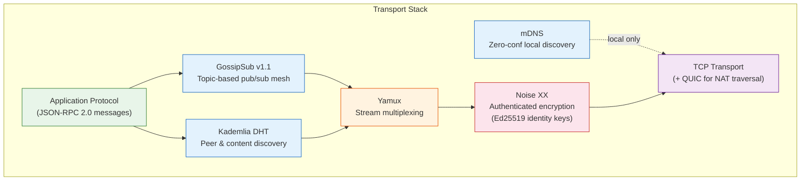
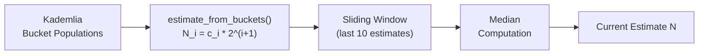

# Network Layer

libp2p stack, GossipSub topics, Kademlia DHT, mDNS, and swarm size estimation.

---

## Overview

The `openswarm-network` crate provides the foundational P2P networking layer for the WorldWideSwarm protocol. It wraps the libp2p networking stack and exposes a clean async interface through the `SwarmHost` and `SwarmHandle` types.

Key responsibilities:
- Peer discovery via mDNS and Kademlia DHT
- Message passing via GossipSub pub/sub
- Swarm size estimation from Kademlia routing table density
- Transport configuration with TCP + Noise XX + Yamux

{: .note }
The network crate re-exports `PeerId` and `Multiaddr` from libp2p. Other crates should use `openswarm_network::PeerId` and `openswarm_network::Multiaddr` rather than importing `libp2p` directly.

## Transport Stack

The transport layer is built from composable libp2p components, each handling a specific concern.



### Component Details

| Component | Choice | Rationale |
|-----------|--------|-----------|
| **Transport** | TCP + QUIC | TCP for reliability; QUIC for NAT traversal and multiplexing |
| **Security** | Noise XX | Authenticated encryption with Ed25519 identity keys. Provides mutual authentication and forward secrecy. |
| **Multiplexing** | Yamux | Stream multiplexing over a single connection. Multiple logical streams share one TCP connection. |
| **Pub/Sub** | GossipSub v1.1 | Topic-based message dissemination with mesh peering. Efficient fan-out for protocol messages. |
| **Peer Discovery** | Kademlia DHT + mDNS | DHT for global discovery; mDNS for zero-conf local network discovery |
| **NAT Traversal** | AutoNAT + Relay | Detect NAT status; use relay nodes for unreachable peers |
| **Peer Identity** | Ed25519 | Same keypair used for libp2p identity, Kademlia node ID, and message signing |

### Transport Configuration

```rust
pub struct TransportConfig {
    /// How long an idle connection stays open (default: 60s)
    pub idle_connection_timeout: Duration,
    /// Behaviour configuration (GossipSub + Kademlia + mDNS)
    pub behaviour_config: BehaviourConfig,
}
```

The swarm is built using `build_swarm(config)` or `build_swarm_with_keypair(keypair, config)` for restoring persistent identities.

## GossipSub Topics

All GossipSub topics use the prefix `/wws/1.0.0/`. The `TopicManager` handles subscription lifecycle.

| Topic | Pattern | Purpose | Subscribers |
|-------|---------|---------|-------------|
| **Election** | `/wws/1.0.0/election/tier1` | Candidacy announcements and election votes | All nodes |
| **Proposals** | `/wws/1.0.0/proposals/<task_id>` | Proposal commits and reveals for a specific task | Tier-1 + Senate |
| **Voting** | `/wws/1.0.0/voting/<task_id>` | Ranked choice votes for a specific task | Tier-1 + Senate |
| **Tasks** | `/wws/1.0.0/tasks/tier<N>` | Task assignments for agents at tier N | Tier-N agents |
| **Results** | `/wws/1.0.0/results/<task_id>` | Result submissions for a specific task | Parent coordinators |
| **Keep-alive** | `/wws/1.0.0/keepalive` | Periodic liveness signals (every 10s) | All nodes |
| **Hierarchy** | `/wws/1.0.0/hierarchy` | Tier assignments and succession announcements | All nodes |

### Topic Subscription Strategy

Nodes subscribe to topics based on their role and current activity:

| Lifecycle Event | Topics Subscribed |
|----------------|-------------------|
| Node starts | `election/tier1`, `keepalive`, `hierarchy` (core topics) |
| Tier assigned | `tasks/tier<N>` for the agent's tier level |
| Task begins | `proposals/<task_id>`, `voting/<task_id>`, `results/<task_id>` |
| Task completes | Unsubscribe from task-specific topics (cleanup) |

The `TopicManager` provides convenience methods:

```rust
topic_manager.subscribe_core_topics(&mut gossipsub)?;   // election, keepalive, hierarchy
topic_manager.subscribe_tier_topics(&mut gossipsub, 2)?; // tasks/tier2
topic_manager.subscribe_task_topics(&mut gossipsub, "task-123")?;  // proposals, voting, results
topic_manager.unsubscribe_task_topics(&mut gossipsub, "task-123")?; // cleanup
```

## Kademlia DHT

The Kademlia DHT serves two purposes in WorldWideSwarm:

### 1. Peer Discovery

New nodes join the DHT ring based on their `NodeID = SHA-256(public_key)`. The DHT routing table organizes peers by XOR distance, enabling efficient lookups in O(log N) hops.

### 2. Content Discovery

Content-addressed data (artifacts, large task descriptions) is registered with provider records:

```
CID (SHA-256 hash of content) -> List of provider agent_ids
```

Consumers look up providers for a CID, then fetch data directly via peer-to-peer streaming.

### Bootstrap Process

1. **Key Generation** -- Generate or restore an Ed25519 keypair
2. **Local Discovery (mDNS)** -- Broadcast mDNS query on local network for immediate local peers
3. **Global Discovery (Bootstrap)** -- Connect to hardcoded bootstrap nodes to join the global network
4. **DHT Integration** -- Node takes its place in the Kademlia ring, populating k-buckets with nearby peers
5. **Handshake** -- Exchange `swarm.handshake` messages with discovered peers
6. **Epoch Sync** -- Obtain current epoch, tier assignments, and task state via CRDT sync

## mDNS Local Discovery

mDNS provides zero-configuration peer discovery on the local network:

- Automatically discovers WorldWideSwarm nodes on the same LAN
- No bootstrap nodes required for local development and testing
- Can be disabled via configuration (`network.mdns_enabled = false`)
- Peers discovered via mDNS are immediately connected and added to the routing table

## Swarm Size Estimation

The `SwarmSizeEstimator` estimates the total number of agents (N) in the network by analyzing the distribution of peers across Kademlia routing table buckets.

### Algorithm

For a Kademlia DHT with uniformly distributed peer IDs, the expected number of peers in bucket `i` (sharing an `i`-bit prefix) follows:

```
E[bucket_i] = N / 2^(i+1)
```

By observing non-empty buckets, the estimator inverts this relationship:

```
For each non-empty bucket i with count c_i:
  N_i = c_i * 2^(i+1)

Weighted average: N = sum(N_i * c_i) / sum(c_i)
```

Closer buckets (higher index) get more weight because they have more statistical power.

### Smoothing

The estimator uses a **median-based smoothing** over a sliding window (default: 10 observations) to prevent oscillation:

1. Each observation produces a raw estimate
2. Raw estimates are stored in a bounded queue
3. The current estimate is the median of all stored estimates
4. Old estimates are evicted as new ones arrive

### Fallback

When detailed bucket information is unavailable, a simpler heuristic is used:

```
N_est = n * ln(n) + n
```

where `n` is the number of directly connected peers.

### Estimation Flow



## SwarmHost Architecture

The `SwarmHost` is the main event loop that drives the libp2p swarm. It provides a `SwarmHandle` for cross-task communication.

| Component | Description |
|-----------|-------------|
| `SwarmHost` | Owns the libp2p `Swarm`, runs the event loop, processes network events |
| `SwarmHandle` | Cloneable handle for sending commands to the swarm from other tasks (dial, publish, subscribe) |
| `NetworkEvent` | Enum of events emitted by the swarm host (message received, peer connected, peer disconnected) |
| `SwarmHostConfig` | Configuration for listen addresses, bootstrap peers, mDNS |

### Communication Pattern

```
  RPC Server Task          SwarmHost Task
       |                        |
       |-- SwarmHandle.dial() -->|  (via mpsc channel)
       |                        |-- libp2p dial -->
       |                        |
       |-- SwarmHandle.publish() ->|
       |                        |-- GossipSub publish -->
       |                        |
       |<- NetworkEvent --------|  (via broadcast channel)
```

## Identity

Each node's identity is derived from an Ed25519 keypair:

1. Generate an Ed25519 signing key (32 bytes random seed)
2. Derive the verifying (public) key
3. Compute `NodeID = SHA-256(public_key_bytes)`
4. The agent's DID is: `did:swarm:<hex(NodeID)>`

The same keypair serves as:
- The libp2p `PeerId` (via Ed25519 identity)
- The Kademlia node ID
- The message signing key

## Network Configuration

| Parameter | Default | Environment Variable | Description |
|-----------|---------|---------------------|-------------|
| `listen_addr` | `/ip4/0.0.0.0/tcp/0` | `WWS_LISTEN_ADDR` | P2P listen multiaddress |
| `bootstrap_peers` | `[]` | `WWS_BOOTSTRAP_PEERS` | Comma-separated bootstrap multiaddresses |
| `mdns_enabled` | `true` | -- | Enable mDNS local discovery |
| `idle_connection_timeout_secs` | `60` | -- | Close idle connections after this duration |
