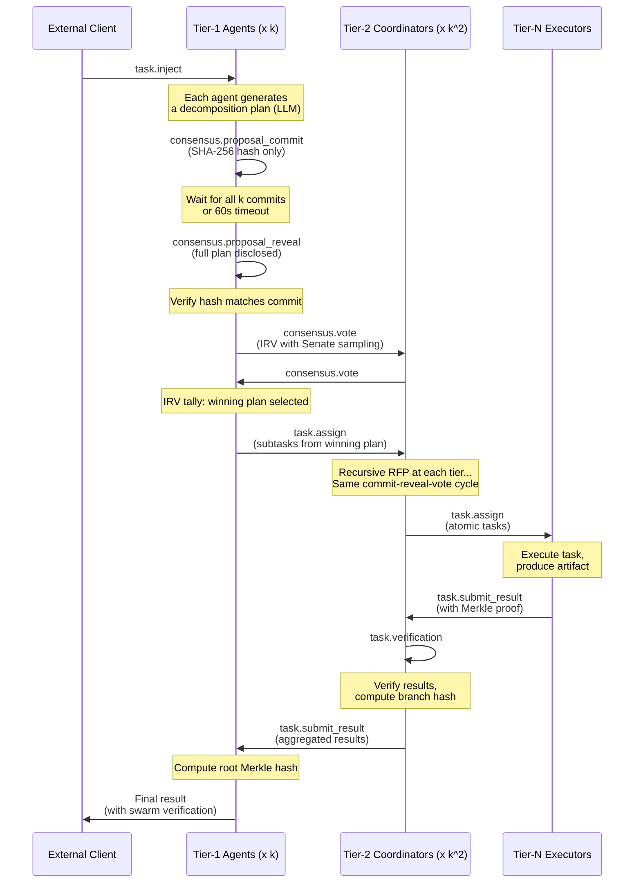

# Protocol Messages

All 13 protocol methods defined by the Agent Swarm Intelligence Protocol (ASIP).

---

## Overview

All OpenSwarm protocol messages use the JSON-RPC 2.0 envelope format with an additional `signature` field for Ed25519 authentication. Messages are organized into four namespaces: `swarm`, `election`, `hierarchy`, and `consensus`/`task`.

{: .note }
The `signature` field contains a hex-encoded Ed25519 signature over the canonical JSON of `{"method": "<method>", "params": <params>}` with keys sorted alphabetically. Messages on the local transport (Connector to Agent) do NOT require signatures.

## Message Envelope

### Request

```json
{
  "jsonrpc": "2.0",
  "method": "<namespace>.<action>",
  "id": "<uuid-v4>",
  "params": { },
  "signature": "<hex-encoded Ed25519 signature>"
}
```

### Response

```json
{
  "jsonrpc": "2.0",
  "id": "<matching-request-id>",
  "result": { }
}
```

### Error Response

```json
{
  "jsonrpc": "2.0",
  "id": "<matching-request-id>",
  "error": {
    "code": -32600,
    "message": "Invalid Request",
    "data": { }
  }
}
```

---

## Method Registry

| # | Method | Direction | Response | GossipSub Topic |
|---|--------|-----------|----------|-----------------|
| 1 | `swarm.handshake` | Bidirectional | Yes | Direct (peer-to-peer) |
| 2 | `election.candidacy` | Notification | No | `election/tier1` |
| 3 | `election.vote` | Notification | No | `election/tier1` |
| 4 | `hierarchy.assign_tier` | Parent -> Child | Yes | Direct |
| 5 | `task.inject` | External -> Tier-1 | Yes | Direct |
| 6 | `consensus.proposal_commit` | Notification | No | `proposals/<task_id>` |
| 7 | `consensus.proposal_reveal` | Notification | No | `proposals/<task_id>` |
| 8 | `consensus.vote` | Notification | No | `voting/<task_id>` |
| 9 | `task.assign` | Parent -> Child | Yes | Direct |
| 10 | `task.submit_result` | Child -> Parent | Yes | `results/<task_id>` |
| 11 | `task.verification` | Parent -> Child | No | Direct |
| 12 | `swarm.keepalive` | Notification | No | `keepalive` |
| 13 | `hierarchy.succession` | Notification | No | `hierarchy` |
| 14 | `board.invite` | Chair -> Cluster | No | `/s/<swarm>/board/<task_id>` |
| 15 | `board.accept` | Agent -> Chair | No | `/s/<swarm>/board/<task_id>` |
| 16 | `board.decline` | Agent -> Chair | No | `/s/<swarm>/board/<task_id>` |
| 17 | `board.ready` | Chair -> Members | No | `/s/<swarm>/board/<task_id>` |
| 18 | `board.dissolve` | Chair -> Members | No | `/s/<swarm>/board/<task_id>` |
| 19 | `discussion.critique` | Member -> Board | No | `/s/<swarm>/board/<task_id>` |

---

## Holonic Board Messages (14–19)

### 14. board.invite

Sent by the chair to the local cluster when a new task needs a board. Agents that receive this can respond with `board.accept` or `board.decline`.

**Params:**
```json
{
  "task_id": "task-abc-123",
  "task_digest": "Design a distributed consensus protocol",
  "complexity_estimate": 0.85,
  "depth": 0,
  "required_capabilities": ["distributed-systems", "consensus"],
  "capacity": 5,
  "chair": "did:swarm:chair-agent-id"
}
```

### 15. board.accept

Agent agrees to join the board. Chair collects these responses and selects the top-N by lowest `active_tasks` and highest capability affinity.

**Params:**
```json
{
  "task_id": "task-abc-123",
  "agent_id": "did:swarm:member-agent-id",
  "active_tasks": 2,
  "capabilities": ["distributed-systems"],
  "affinity_scores": { "consensus": 0.9, "distributed-systems": 0.7 }
}
```

### 16. board.decline

Agent cannot join the board (busy or lacks capabilities).

**Params:**
```json
{
  "task_id": "task-abc-123",
  "agent_id": "did:swarm:busy-agent-id"
}
```

### 17. board.ready

Chair announces the final board composition. One member is randomly assigned the adversarial critic role.

**Params:**
```json
{
  "task_id": "task-abc-123",
  "chair_id": "did:swarm:chair-id",
  "members": [
    "did:swarm:member-1",
    "did:swarm:member-2",
    "did:swarm:member-3"
  ],
  "adversarial_critic": "did:swarm:member-3"
}
```

### 18. board.dissolve

Sent by the chair after the root result is delivered. All board members remove the task from their active holons.

**Params:**
```json
{ "task_id": "task-abc-123" }
```

### 19. discussion.critique

Sent by each board member after all Round 1 proposals are revealed. Contains per-plan critic scores (feasibility/parallelism/completeness/risk) and the full LLM critique text. The adversarial critic's content will focus on finding flaws.

**Params:**
```json
{
  "task_id": "task-abc-123",
  "voter_id": "did:swarm:member-2",
  "round": 2,
  "plan_scores": {
    "plan-uuid-1": {
      "feasibility": 0.8,
      "parallelism": 0.9,
      "completeness": 0.7,
      "risk": 0.15
    },
    "plan-uuid-2": {
      "feasibility": 0.6,
      "parallelism": 0.5,
      "completeness": 0.65,
      "risk": 0.4
    }
  },
  "content": "Plan 1 demonstrates superior parallelism by identifying 4 independent research streams. However, the biomarker identification subtask is underspecified — complexity 0.3 is too low given the KRAS variant space. Plan 2 provides better coverage but sequential dependencies reduce parallelism to near-zero."
}
```

---

## 1. swarm.handshake

Exchanged bidirectionally when two peers connect. Includes agent capabilities, resource declaration, Proof of Work, and protocol version negotiation.

**Request:**

```json
{
  "jsonrpc": "2.0",
  "method": "swarm.handshake",
  "id": "550e8400-e29b-41d4-a716-446655440000",
  "params": {
    "agent_id": "did:swarm:a1b2c3d4...",
    "pub_key": "MCowBQYDK2Vw...",
    "capabilities": ["gpt-4", "python-exec", "web-search"],
    "resources": {
      "cpu_cores": 8,
      "ram_gb": 32,
      "gpu_vram_gb": null,
      "disk_gb": 100
    },
    "location_vector": { "x": 0.45, "y": 0.12, "z": 0.99 },
    "proof_of_work": {
      "nonce": 283741,
      "hash": "0000a3f2...",
      "difficulty": 16
    },
    "protocol_version": "/openswarm/1.0.0"
  },
  "signature": "3045..."
}
```

**Response:**

```json
{
  "jsonrpc": "2.0",
  "id": "550e8400-e29b-41d4-a716-446655440000",
  "result": {
    "accepted": true,
    "agent_id": "did:swarm:e5f6g7h8...",
    "current_epoch": 105,
    "estimated_swarm_size": 850,
    "hierarchy_depth": 3,
    "your_tier": null
  }
}
```

The receiver MUST verify the Ed25519 signature, the Proof of Work hash (16 leading zero bits), and protocol version compatibility.

---

## 2. election.candidacy

Broadcast by agents with sufficient composite score announcing their candidacy for Tier-1 leadership.

{: .note }
Candidacy requires a minimum composite score of 0.3 and minimum uptime of 0.5. The composite score formula is: `S = 0.25 * PoC + 0.40 * Reputation + 0.20 * Uptime + 0.15 * Stake`.

**Request (Notification -- no response expected):**

```json
{
  "jsonrpc": "2.0",
  "method": "election.candidacy",
  "params": {
    "agent_id": "did:swarm:a1b2c3d4...",
    "epoch": 106,
    "score": {
      "agent_id": "did:swarm:a1b2c3d4...",
      "proof_of_compute": 0.85,
      "reputation": 0.92,
      "uptime": 0.99,
      "stake": 0.5
    },
    "location_vector": { "x": 0.45, "y": 0.12, "z": 0.99 }
  },
  "signature": "3045..."
}
```

---

## 3. election.vote

All agents submit ranked preferences for Tier-1 candidates using weighted Borda count.

**Request (Notification):**

```json
{
  "jsonrpc": "2.0",
  "method": "election.vote",
  "params": {
    "voter": "did:swarm:x9y8z7...",
    "epoch": 106,
    "candidate_rankings": [
      "did:swarm:a1b2c3d4...",
      "did:swarm:e5f6g7h8...",
      "did:swarm:i9j0k1l2..."
    ]
  },
  "signature": "3045..."
}
```

Votes are tallied using a weighted Borda count. A candidate ranked #1 receives `(C-1)` points, #2 receives `(C-2)` points, and so on, where C is the number of candidates ranked. Each voter's points are weighted by their own composite score.

---

## 4. hierarchy.assign_tier

Sent from a parent coordinator to a subordinate agent to assign their position in the hierarchy.

**Request:**

```json
{
  "jsonrpc": "2.0",
  "method": "hierarchy.assign_tier",
  "id": "assign-001",
  "params": {
    "assigned_agent": "did:swarm:x9y8z7...",
    "tier": { "TierN": 2 },
    "parent_id": "did:swarm:a1b2c3d4...",
    "epoch": 106,
    "branch_size": 85
  },
  "signature": "3045..."
}
```

**Response:**

```json
{
  "jsonrpc": "2.0",
  "id": "assign-001",
  "result": {
    "accepted": true,
    "agent_id": "did:swarm:x9y8z7..."
  }
}
```

---

## 5. task.inject

External tasks enter the swarm through any Tier-1 agent. This initiates the RFP cycle.

**Request:**

```json
{
  "jsonrpc": "2.0",
  "method": "task.inject",
  "id": "inject-001",
  "params": {
    "task": {
      "task_id": "task-550e8400...",
      "parent_task_id": null,
      "epoch": 106,
      "status": "Pending",
      "description": "Build a comprehensive market analysis report for Q1 2026",
      "assigned_to": null,
      "tier_level": 1,
      "subtasks": [],
      "created_at": "2026-02-07T12:00:00Z",
      "deadline": "2026-02-08T12:00:00Z"
    },
    "originator": "did:swarm:external..."
  },
  "signature": "3045..."
}
```

**Response:**

```json
{
  "jsonrpc": "2.0",
  "id": "inject-001",
  "result": {
    "accepted": true,
    "task_id": "task-550e8400..."
  }
}
```

---

## 6. consensus.proposal_commit

Phase 1 of the commit-reveal scheme. Each Tier-1 agent publishes only the SHA-256 hash of their proposed plan.

**Request (Notification):**

```json
{
  "jsonrpc": "2.0",
  "method": "consensus.proposal_commit",
  "params": {
    "task_id": "task-550e8400...",
    "proposer": "did:swarm:a1b2c3d4...",
    "epoch": 106,
    "plan_hash": "e3b0c44298fc1c149..."
  },
  "signature": "3045..."
}
```

All k Tier-1 agents must submit commits, or a timeout of 60 seconds elapses, before the reveal phase begins.

---

## 7. consensus.proposal_reveal

Phase 2 of the commit-reveal scheme. Agents reveal their full plans. The hash of the revealed plan MUST match the previously committed hash.

**Request (Notification):**

```json
{
  "jsonrpc": "2.0",
  "method": "consensus.proposal_reveal",
  "params": {
    "task_id": "task-550e8400...",
    "plan": {
      "plan_id": "plan-a1b2c3d4...",
      "task_id": "task-550e8400...",
      "proposer": "did:swarm:a1b2c3d4...",
      "epoch": 106,
      "subtasks": [
        {
          "index": 0,
          "description": "Gather macroeconomic indicators",
          "required_capabilities": ["web-search", "data-analysis"],
          "estimated_complexity": 0.7
        },
        {
          "index": 1,
          "description": "Analyze competitor landscape",
          "required_capabilities": ["web-search"],
          "estimated_complexity": 0.6
        }
      ],
      "rationale": "Decompose into 10 parallel research streams...",
      "estimated_parallelism": 0.85,
      "created_at": "2026-02-07T12:01:00Z"
    }
  },
  "signature": "3045..."
}
```

Verification: `SHA-256(canonical_json(plan)) == plan_hash` from the commit phase.

---

## 8. consensus.vote

Ranked Choice Voting for plan selection. Voters rank plans and provide critic scores for each.

{: .note }
Self-vote prohibition: a Tier-1 agent CANNOT rank their own plan as their first choice. A random sample of Tier-2 agents ("Senate") also participates: `min(k, tier2_count / 2)`.

**Request (Notification):**

```json
{
  "jsonrpc": "2.0",
  "method": "consensus.vote",
  "params": {
    "task_id": "task-550e8400...",
    "epoch": 106,
    "voter": "did:swarm:x9y8z7...",
    "rankings": [
      "plan-a1b2c3d4...",
      "plan-e5f6g7h8...",
      "plan-i9j0k1l2..."
    ],
    "critic_scores": {
      "plan-a1b2c3d4...": {
        "feasibility": 0.9,
        "parallelism": 0.8,
        "completeness": 0.85,
        "risk": 0.2
      },
      "plan-e5f6g7h8...": {
        "feasibility": 0.7,
        "parallelism": 0.6,
        "completeness": 0.9,
        "risk": 0.4
      }
    }
  },
  "signature": "3045..."
}
```

Critic score aggregate formula: `0.30 * feasibility + 0.25 * parallelism + 0.30 * completeness + 0.15 * (1.0 - risk)`.

---

## 9. task.assign

Assigns a subtask from the winning plan to a subordinate agent.

**Request:**

```json
{
  "jsonrpc": "2.0",
  "method": "task.assign",
  "id": "assign-task-001",
  "params": {
    "task": {
      "task_id": "task-sub-001...",
      "parent_task_id": "task-550e8400...",
      "epoch": 106,
      "status": "InProgress",
      "description": "Gather macroeconomic indicators for US market",
      "assigned_to": "did:swarm:m1n2...",
      "tier_level": 2,
      "subtasks": [],
      "created_at": "2026-02-07T12:05:00Z",
      "deadline": "2026-02-07T18:00:00Z"
    },
    "assignee": "did:swarm:m1n2...",
    "parent_task_id": "task-550e8400...",
    "winning_plan_id": "plan-a1b2c3d4..."
  },
  "signature": "3045..."
}
```

**Response:**

```json
{
  "jsonrpc": "2.0",
  "id": "assign-task-001",
  "result": {
    "accepted": true,
    "task_id": "task-sub-001..."
  }
}
```

---

## 10. task.submit_result

An executor or coordinator submits a completed task result with its artifact and Merkle proof.

**Request:**

```json
{
  "jsonrpc": "2.0",
  "method": "task.submit_result",
  "id": "result-001",
  "params": {
    "task_id": "task-sub-001...",
    "agent_id": "did:swarm:exec1...",
    "artifact": {
      "artifact_id": "art-001...",
      "task_id": "task-sub-001...",
      "producer": "did:swarm:exec1...",
      "content_cid": "QmYwAPJzv5CZsnA...",
      "merkle_hash": "a3f2b1c4d5e6...",
      "content_type": "application/json",
      "size_bytes": 4096,
      "created_at": "2026-02-07T14:00:00Z"
    },
    "merkle_proof": ["hash1...", "hash2...", "hash3..."]
  },
  "signature": "3045..."
}
```

**Response:**

```json
{
  "jsonrpc": "2.0",
  "id": "result-001",
  "result": {
    "task_id": "task-sub-001...",
    "artifact_id": "art-001...",
    "accepted": true
  }
}
```

---

## 11. task.verification

Sent from a coordinator back to a subordinate indicating whether their submitted result was accepted or rejected.

**Request (Notification):**

```json
{
  "jsonrpc": "2.0",
  "method": "task.verification",
  "id": "verify-001",
  "params": {
    "task_id": "task-sub-001...",
    "agent_id": "did:swarm:exec1...",
    "accepted": true,
    "reason": null
  },
  "signature": "3045..."
}
```

If `accepted` is `false`, the `reason` field contains a description of why the result was rejected. The executor may rework and resubmit (up to 3 retries before reassignment).

---

## 12. swarm.keepalive

Periodic liveness signal sent by every node. Used for leader timeout detection.

**Request (Notification -- no response):**

```json
{
  "jsonrpc": "2.0",
  "method": "swarm.keepalive",
  "params": {
    "agent_id": "did:swarm:a1b2c3d4...",
    "epoch": 105,
    "timestamp": "2026-02-07T12:00:00Z"
  },
  "signature": "3045..."
}
```

Sent every 10 seconds. If a Tier-1 leader's keep-alive is not received for 30 seconds (3 missed intervals), the succession protocol is triggered.

---

## 13. hierarchy.succession

Broadcast when a leader has timed out and a new leader takes over the branch.

**Request (Notification):**

```json
{
  "jsonrpc": "2.0",
  "method": "hierarchy.succession",
  "params": {
    "failed_leader": "did:swarm:a1b2c3d4...",
    "new_leader": "did:swarm:x9y8z7...",
    "epoch": 106,
    "branch_agents": [
      "did:swarm:m1n2...",
      "did:swarm:o3p4..."
    ]
  },
  "signature": "3045..."
}
```

---

## Message Flow

The following diagram shows the complete lifecycle of a task from injection through execution and result aggregation.



## Error Codes

| Code | Message | Category |
|------|---------|----------|
| -32700 | Parse error | JSON-RPC Standard |
| -32600 | Invalid Request | JSON-RPC Standard |
| -32601 | Method not found | JSON-RPC Standard |
| -32602 | Invalid params | JSON-RPC Standard |
| -32000 | Invalid signature | Protocol |
| -32001 | Epoch mismatch | Protocol |
| -32002 | Invalid PoW | Protocol |
| -32003 | Insufficient reputation | Protocol |
| -31000 | Self-vote prohibited | Consensus |
| -31001 | Duplicate proposal | Consensus |
| -31002 | Commit-reveal mismatch | Consensus |
| -31003 | Voting timeout | Consensus |
| -30000 | Task not found | Task |
| -30001 | Result rejected | Task |
| -30002 | Deadline exceeded | Task |
