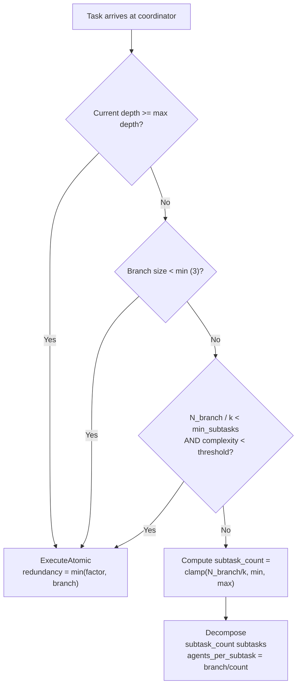

# State Management

OR-Set CRDTs, Merkle-DAG verification, content-addressed storage, and adaptive granularity.

---

## Overview

WorldWideSwarm's state management layer is built on two complementary systems:

- **Hot State (OR-Set CRDT)** -- Real-time mutable state (task status, agent lists) replicated across nodes using conflict-free data structures
- **Cold Context (Merkle-DAG + CAS)** -- Immutable artifacts and results stored with content-addressing and verified through hash chains

These are implemented in the `openswarm-state` crate with four modules: `crdt`, `merkle_dag`, `content_store`, and `granularity`.

## OR-Set CRDT

The **Observed-Remove Set (OR-Set)** is a conflict-free replicated data type that supports concurrent add and remove operations across distributed nodes with guaranteed convergence. No coordination (locks, consensus) is required for state updates.

### Add-Wins Semantics

The OR-Set uses **add-wins** conflict resolution: when one node adds an element concurrently with another node removing it, the add wins. This is achieved through unique tagging:

- Each `add()` operation generates a fresh `UniqueTag = (node_id, counter)` for the value
- Each `remove()` operation tombstones all *currently known* tags for the value
- A concurrent add on another node creates a tag the remover has never seen, so it survives the merge

{: .note }
The `elements()` method returns `Vec<T>` (owned values), not references. An element is present if it has at least one tag that is NOT in the tombstone set.

### CRDT Operations

| Operation | Description |
|-----------|-------------|
| `add(value)` | Insert value with a new unique tag. Counter increments monotonically. |
| `remove(value)` | Move all currently-known tags for the value into the tombstone set. |
| `contains(value)` | Returns `true` if the value has at least one non-tombstoned tag. |
| `elements()` | Returns `Vec<T>` of all currently present elements. |
| `merge(other)` | Union of entries and tombstones from the other replica. |
| `len()` | Count of present elements (those with at least one live tag). |

### Merge Operation

The merge is commutative, associative, and idempotent (the three CRDT properties):

```
merge(A, B):
  entries  = A.entries  UNION  B.entries    (union of all tags per value)
  tombstones = A.tombstones UNION B.tombstones  (union of all tombstoned tags)
```

After merge, a value is present if it has at least one tag that is NOT in the combined tombstone set.

### Managed State

| State | CRDT Type | Usage |
|-------|-----------|-------|
| Task Registry | `OrSet<String>` (aliased as `TaskStatusSet`) | Current status of all active tasks |
| Agent Registry | `OrSet<String>` (aliased as `AgentSet`) | Active agents per tier/branch |
| Epoch State | LWW-Register | Current epoch number and metadata |

### Synchronization

CRDT state is synchronized across the swarm via three mechanisms:

1. **Piggybacking** -- State deltas are attached to keep-alive messages (every 10 seconds)
2. **Anti-entropy** -- Periodic full-state exchange between neighbors (every 60 seconds)
3. **On-demand** -- Explicit state request during handshake or succession recovery

### Concurrent Update Example

```
Node A:                     Node B:
  add("task-1")              add("task-1")
  tag: (A, 1)                tag: (B, 1)

     --- merge ---

Node A sees:
  entries["task-1"] = {(A,1), (B,1)}
  tombstones = {}
  => "task-1" is present (two live tags)

Node A:                     Node B:
  add("task-1")              remove("task-1")
  tag: (A, 2)                tombstones: {(A,1), (B,1)}

     --- merge ---

Node A sees:
  entries["task-1"] = {(A,1), (A,2), (B,1)}
  tombstones = {(A,1), (B,1)}
  => "task-1" is STILL present (tag (A,2) is not tombstoned)
  => ADD WINS
```

## Merkle-DAG Verification

The `MerkleDag` provides bottom-up cryptographic verification of task results as they flow up the hierarchy from executors to orchestrators.

### Node Types

| Type | Hash Computation | Description |
|------|-----------------|-------------|
| **Leaf** | `H_leaf = SHA-256(content_bytes)` | Individual executor result |
| **Branch** | `H_branch = SHA-256(H_child_0 \|\| H_child_1 \|\| ... \|\| H_child_{k-1})` | Coordinator aggregating subordinate results |
| **Root** | Same as branch | Tier-1 final aggregate |

{: .note }
Child ordering matters: children are concatenated by their task index (0 to k-1) before hashing. This means the branch hash depends on the order of subtasks, not just their content.

### Verification Properties

- **Efficient verification** -- Any coordinator can verify a subtree by checking hashes without downloading all content
- **Tamper detection** -- Any modification to any result invalidates the root hash
- **Incremental assembly** -- Results can be added to the DAG as they arrive; the full tree does not need to be present up front

### Merkle-DAG Verification Chain

```mermaid
graph BU
    subgraph "Tier-3: Executor Results"
        E1["Exec 1<br/>H = SHA-256(content_1)<br/><i>leaf hash</i>"]
        E2["Exec 2<br/>H = SHA-256(content_2)<br/><i>leaf hash</i>"]
        E3["Exec 3<br/>H = SHA-256(content_3)<br/><i>leaf hash</i>"]
        E4["Exec 4<br/>H = SHA-256(content_4)<br/><i>leaf hash</i>"]
        E5["Exec 5<br/>H = SHA-256(content_5)<br/><i>leaf hash</i>"]
        E6["Exec 6<br/>H = SHA-256(content_6)<br/><i>leaf hash</i>"]
    end

    subgraph "Tier-2: Coordinator Verification"
        C1["Coordinator A<br/>H = SHA-256(H1 || H2 || H3)<br/><i>branch hash</i>"]
        C2["Coordinator B<br/>H = SHA-256(H4 || H5 || H6)<br/><i>branch hash</i>"]
    end

    subgraph "Tier-1: Root Verification"
        R["Root Orchestrator<br/>H_root = SHA-256(H_A || H_B)<br/><i>swarm Merkle root</i>"]
    end

    E1 --> C1
    E2 --> C1
    E3 --> C1
    E4 --> C2
    E5 --> C2
    E6 --> C2
    C1 --> R
    C2 --> R
```

### Proof Verification

A Merkle proof is valid when:

1. The leaf hash appears in the proof path
2. Recomputing hashes from the proof elements produces the expected root hash

```rust
MerkleDag::verify_proof(root_hash, &proof_path, leaf_hash) -> bool
```

### Coordinator Review Process

When a Coordinator receives results from subordinates:

1. **Automated check** -- Run an LLM-Validator (Judge) to verify result compliance with the task
2. **Accept** -- If valid, merge results into a summary and compute the branch Merkle hash
3. **Reject** -- If invalid, return with `task.verification { accepted: false, reason: "..." }` for rework (up to 3 retries) or reassignment

## Content-Addressed Storage

Large data (task descriptions, artifacts, logs) is stored using content-addressing with IPFS-style CIDs.

### Storage Flow

1. The producing agent stores data locally
2. Computes `CID = SHA-256(data)`
3. Publishes a provider record to the Kademlia DHT: `CID -> agent_id`
4. Consumers retrieve data by looking up providers for the CID in the DHT, then requesting the data directly via peer-to-peer streaming

### Data Retention

| Data Type | Retention Policy |
|-----------|-----------------|
| Hot state (CRDT) | Current epoch + 2 (sliding window) |
| Cold context | Duration of the task + configurable grace period |
| Artifacts | Pinned by the task originator; unpinned data may be garbage-collected |

## Adaptive Granularity Algorithm

The `GranularityEngine` and `GranularityAlgorithm` determine optimal task decomposition depth based on the available workforce.

### Core Formula

```
S = min(k, max(1, N_branch / k))
```

Where:
- `S` = number of subtasks to create
- `N_branch` = number of agents in the current coordinator's branch
- `k` = branching factor (default: 10)

### Decomposition Strategies

| Condition | Strategy | Description |
|-----------|----------|-------------|
| `N_branch > k^2` | **Massive Parallelism** | Create k subtasks, each designed for further decomposition. Force deep recursion. |
| `k < N_branch <= k^2` | **Standard Decomposition** | Create k subtasks, each assigned to a subordinate. |
| `N_branch <= k` | **Direct Assignment** | Assign the task directly without further decomposition. |
| Atomic task, `N_branch > 1` | **Redundant Execution** | Assign the same task to `min(N_branch, k)` agents for reliability or variation. |

### Instance-Based Algorithm

The `GranularityAlgorithm` provides a more sophisticated decomposition decision that considers:

- Current hierarchy depth vs. maximum depth
- Minimum branch size for decomposition (default: 3)
- Task estimated complexity vs. threshold (default: 0.7)
- Redundancy factor for atomic tasks (default: 3)

It returns either:
- `GranularityDecision::Decompose { subtask_count, agents_per_subtask }` -- continue decomposing
- `GranularityDecision::ExecuteAtomic { redundancy }` -- execute at this level

### Decomposition Decision Flow



### Examples

| Branch Size | k | Optimal Subtasks | Strategy |
|-------------|---|-----------------|----------|
| 1000 | 10 | 10 | Massive Parallelism |
| 100 | 10 | 10 | Standard Decomposition |
| 50 | 10 | 5 | Standard Decomposition |
| 8 | 10 | 1 | Direct Assignment |
| 3 | 10 | 1 | Direct Assignment |
| 50 (atomic) | 10 | 10 (redundant) | Redundant Execution |
